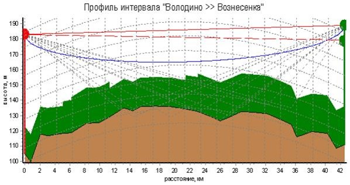
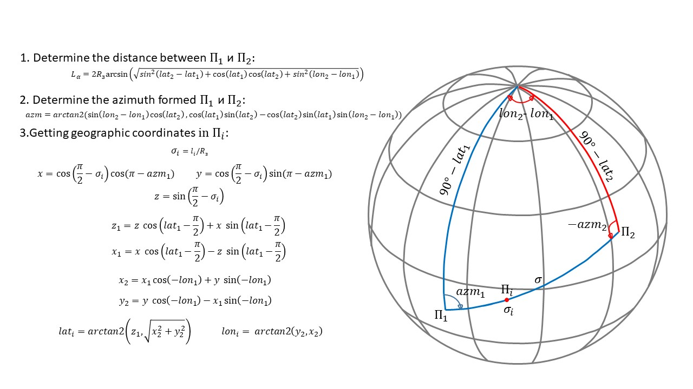
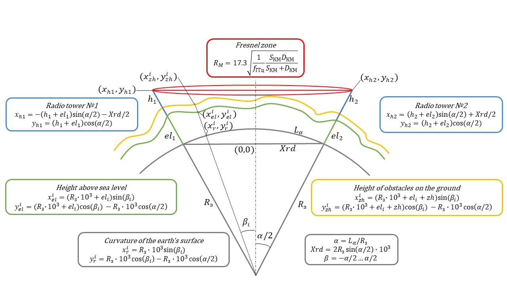
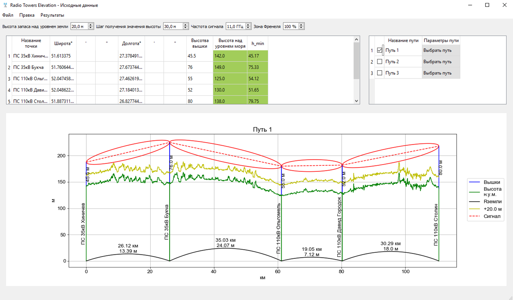
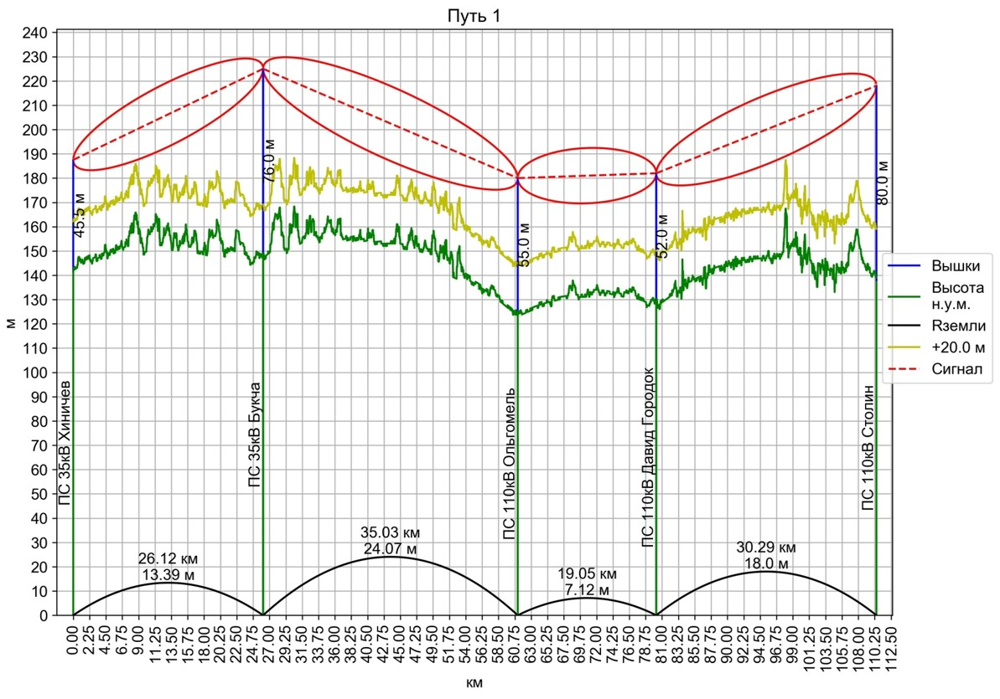

## RadioTowersElevation

## Scope of application 
 
**RadioTowerElevation** - desktop application, designed for making track profiles of radio relay communication lines (RRL) and finding optimal radio towers height of RRL.

**RadioTowersElevation** - десктопное приложение, предназначенное для построения профилей трасс радио-релейных линий связи (РРЛ) и определения оптимальной высоты радиомачт РРЛ.

## Table of contents

  1. [Description](#Description)
  2. [Used technologies](#Used-technologies)
  3. [Installation](#Installation)
  4. [License](#License)

## Description

Radio relay communication line (RRL) is radio wave communication channel of direct visibly. This channel has high throughput and communication distance. It is used for making different channel of communication, including for energetics.

Радиорелейная линия связи (РРЛ) – это радиоволновой канал связи прямой видимости. Данный канал обладает высокой пропускной способностью и дальностью связи. Применяется для организации различных каналов связи, в том числе и для нужд энергетики. 

Longitudinal RRL track profile describes natural curvature of earth surface, ground relief along track, height and length of objects on earth surface, which it's necessary to take into account for definition of height of radio towers so that way of signal and some area around  do not have barriers disturbing signal transmission.

Продольный профиль трассы РРЛ описывает естественное искривление поверхности земли, рельеф местности вдоль трассы, высоту и продолжительность объектов на поверхности земли, от которых необходимо отстроить высоту радиомачт, чтоб на пути следования сигнала и в некоторой области вокруг него не было препятствий, препядстувющих передаче сигнала.

For making of track profile the most difficult task is getting of ground relief along RRL track. For this is used [SRTM](https://www2.jpl.nasa.gov/srtm/) data, which represent digital model of earth surface which describe height above sea level and connected with geographical coordinates (latitude and longitude). Since geographical coordinates of radio towers installation locations and its heights are used as initial data for making of track profile, it was necessary way of getting geographical coordinates along RRL track  and with definite step to get height above sea level value for current point from [SRTM](https://www2.jpl.nasa.gov/srtm/). For it is used next mathematical expressions.

В построении профилей самой сложной задачей является получение рельефа местности вдоль трассы РРЛ. Для этого используются данные [SRTM](https://www2.jpl.nasa.gov/srtm/), которые представляют собой цифровую модель поверхнсти земли описывающие высоту над уровнем моря котороя привязана к географическим координатам. Так как в качестве исходных данных для построения профиля используются географические координаты мест установки радиомачт и их высота, был необходим механизм получения географических координат вдоль профиля РРЛ и с конкретным шагом чтобы извлечь значение высоты над уровнем для данной точки из [SRTM](https://www2.jpl.nasa.gov/srtm/). Для этого используются следующие математические выражения.

First of all, distance between radio towers installation locations is defined in kilometers. Next it's necessary to define azimuth that forming by geographical coordinates of radio towers installation locations. After that array of intermediate points on RRL track is made, which is used for calculating the respective geographical coordinates and making heights above sea level array.

Первоначально определяется растояние между местами установки радиомачт в километрах. Затем определяем азимут, который образуется географическими координатами мест установки радиомачт. Затем составляем массив промеждуточных точек по трассе РРЛ, на основании которого определяем соотвествующие им гегографические координаты по которым составляем массив высот над уровмнем моря.

Then making of track profile is realized by next mathematical expressions.

Далее построение профиля осуществляется по следующим математическим выражениям.

These expressions are made so that replace center of a Cartesian coordinate system to center of chord, which is defined of radio towers installation locations, in order to do calculating easier and make readable track profile. Influence of earth surface curvature is defined with radius of earth (6371.0 km). Height of objects on earth surface is settled by way of making additional line that shifted upward at a given distance. Heights every radio tower are settled by user so that line defining of fresnel zone line doesn't cross with defining of objects height line.

Данные выражения сделаны таким образом чтобы сместить центр декардовой системы координат на цент хорды, котороя образуется местами установки радиомачт чтобы упростить расчёт и в последующем построить читаемый профиль. Влияние искривления поверхности земли определяется по радиусу земли (6371.0 км). Высота объектов на поверхности земли задаётся путём построения дополнительной кривой смещённой вверх на заданное растояние. Высота каждой радиомачты задаётся пользователем таким образом чтобы кривая определяющая зону френеля не пересеалось с кривой определяющей высоту обьектов на поверхости земли.

GUI was realized using [PyQt5](https://pypi.org/project/PyQt5/5.9/) library and has next form:

Графический интерфейс реализован при помощи библиотеки [PyQt5](https://pypi.org/project/PyQt5/5.9/) и имеет следующий вид: 

Application window has three main parts: table for setting radio towers parameters, table for forming direction of RRL track, RRL track profile which is made using [Matplotlib](https://pypi.org/project/matplotlib/2.2.2/) library. The application supports making RRL track profiles for more 2 radio towers that allows to make them more informative. The application for saving and opening of initial data uses .xlsx files, so work with this type of files was realized using [Openpyxl](https://pypi.org/project/openpyxl/2.4.8/) library. Output of made RRL track profiles was realized by way creating their raster or vector images, which are possible to flexibly customize, namely to change text font and font size, graph grid step, shape and quality of image, displaying complicated profile by one plot or some plots.

Окно приложения представляют три основные области: таблица для задания параметров радиомачт, таблица для формирования направления трассы РРЛ, профиль РРЛ который строится при при помощи библиотеки [Matplotlib](https://pypi.org/project/matplotlib/2.2.2/). В данном приложении поддреживается построение профилий трасс РРЛ для более 2 радиомачт, что позволяет предоставлять информацию в более наглядном виде. Приложение в качестве сохраняемых и открываенмых файлов с исходными данными работает с файлами формата .xlsx, и для их поддержки используется библиотека [Openpyxl](https://pypi.org/project/openpyxl/2.4.8/). Вывод построенных профилей трасс РРЛ реализован путём создания растровых или векторных изображений данных профилей, которые можно гибко настраивать, а именно изменять шрифт и размер текста, шаг сетки графиков, размер и качество изображения, отбражение сложного профиля одним графиком или несколькими.

## Used technologies

- [Python 3.6.2](https://www.python.org/downloads/) - Python programming language interpreter.
- [Numpy 1.15.0](https://pypi.org/project/numpy/1.15.0/) - general-purpose array-processing package designed to efficiently manipulate large multi-dimensional arrays of arbitrary records without sacrificing too much speed for small multi-dimensional arrays.
- [PyQt5 5.9](https://pypi.org/project/PyQt5/5.9/) - Python binding of the cross-platform GUI toolkit Qt, implemented as a Python plug-in.
- [Matplotlib 2.2.2](https://pypi.org/project/matplotlib/2.2.2/) - library for interactive graphing, scientific publishing, user interface development and web application servers targeting multiple user interfaces and hardcopy output formats.
- [Openpyxl 2.4.8](https://pypi.org/project/openpyxl/2.4.8/) - Python library to read/write Excel 2010 xlsx/xlsm/xltx/xltm files.

## Installation 
Для того чтобы использовать данное приложение необходимо установить компоненты с раздела [Used technologies](#Used-technologies). Первоначально установите интерпретатор Python, а затем при помощи пакетного менеджера *Pip* установите перечисленные пакеты. При применении версий пакетов отличных от предложенных работоспособность приложения не гарантируется.

For using the application necessity to install components from section [Used technologies](#Used-technologies). First of all install Python interpreter, and after that using package manager *Pip* to install listed packages. In case using versions of packages that differ from the proposed, correct work of the application is not ensured. After that you need to download SRTM data for your region from https://www2.jpl.nasa.gov/srtm/ or other sources and save it in dirrectory "hgt".

        pip install -r requirements.txt

## License 
Licensed under the [MIT](LICENSE.txt) license.	
